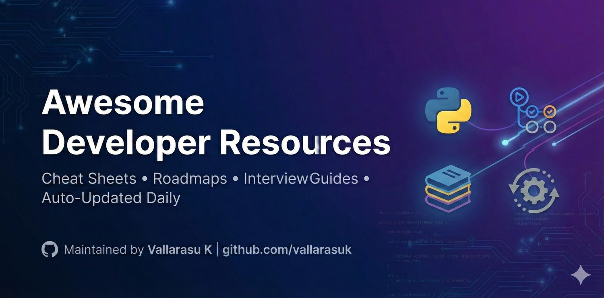

# 🚀 Awesome Developer Resources

A curated collection of cheat sheets, interview guides, and roadmaps for modern developers.
**Maintained by [Vallarasu K](https://vallarasuk.com)**

---

## 🌐 Connect with Me
| Platform | Link |
| :--- | :--- |
| **Portfolio** | [vallarasuk.com](https://vallarasuk.com) |
| **LinkedIn** | [linkedin.vallarasuk.com](https://linkedin.vallarasuk.com) |
| **GitHub** | [github.vallarasuk.com](https://github.vallarasuk.com) |
| **Instagram** | [insta.vallarasuk.com](http://insta.vallarasuk.com/) |
| **WhatsApp Community** | [Join the Squad 🚀](http://squad.vallarasuk.com/) |

---

## 🛠️ My Products & Tools
Here are some free tools and SaaS products I have built:

| Project | Description | Link |
| :--- | :--- | :--- |
| **ATS Resume Maker** | Create ATS-friendly resumes for free. | [atsresumemaker.vallarasuk.com](https://atsresumemaker.vallarasuk.com/) |
| **Place Finder** | Find great places around you. | [placefinder.vallarasuk.com](https://placefinder.vallarasuk.com/) |
| **Dev Portfolio** | My developer-centric portfolio. | [dev.vallarasuk.com](https://dev.vallarasuk.com) |
| **Book Store** | Curated books collection. | [books.vallarasuk.com](https://books.vallarasuk.com/) |
| **Space App** | Explore the universe. | [space.vallarasuk.com](https://space.vallarasuk.com/) |

---

## 🧩 Extensions (VS Code & Chrome)
Boost your productivity with these extensions:

* **[Auto Console Log (VS Code)](https://marketplace.visualstudio.com/items?itemName=VallarasuKanthasamy.auto-console-log-by-vallarasu-kanthasamy)** - Insert console logs with one shortcut.
* **[Tech Stack Checker (Chrome)](https://chromewebstore.google.com/detail/tech-stack-checker/lhcplmfhkmjobfnndaabeddibhimghgf?hl=en)** - Identify website technologies instantly.
* **[Opacity Adjuster (Chrome)](https://chromewebstore.google.com/detail/opacity-adjuster/elgajofcbjicopepiodbabodkajnihog?hl=en)** - Change web element opacity for testing.
* **[View All VS Code Extensions](https://marketplace.visualstudio.com/publishers/VallarasuKanthasamy)**

---

## 🔍 Quick Search (Categories)
> Click a category to jump to that section.

[📂 All Resources](#-all-resources) | [🗺️ Roadmaps](#-roadmaps) | [📝 Cheat Sheets & PDFs](#-cheat-sheets--pdfs) | [💼 Interview Guides](#-interview-guides)

---

## 📚 Latest Resources (Auto-Updated)

### 📂 All Resources
| Resource Name | Link |
| :--- | :--- |
| **Javascript The Good Parts** | [Read Now](https://resources.vallarasuk.com/javascript-the-good-parts/) |
| **Golden Rules For Coding Interviews** | [Read Now](https://resources.vallarasuk.com/golden-rules-for-coding-interviews/) |
| **Spring Interview Questions Answers** | [Read Now](https://resources.vallarasuk.com/spring-interview-questions-answers/) |
| **Greedybacktracking** | [Read Now](https://resources.vallarasuk.com/greedybacktracking/) |
| **Mongodbnotesforprofessionals** | [Read Now](https://resources.vallarasuk.com/mongodbnotesforprofessionals/) |
| **Things I Wish I Was Told In My 20S** | [Read Now](https://resources.vallarasuk.com/things-i-wish-i-was-told-in-my-20s/) |
| **Mongodb** | [Read Now](https://resources.vallarasuk.com/mongodb/) |
| **Java Interview Questions** | [Read Now](https://resources.vallarasuk.com/java-interview-questions/) |
| **Osfullnotes** | [Read Now](https://resources.vallarasuk.com/osfullnotes/) |
| **Top 50 Python Interview Questions With Answers** | [Read Now](https://resources.vallarasuk.com/top-50-python-interview-questions-with-answers/) |
| **Sap Mm Questionnaire** | [Read Now](https://resources.vallarasuk.com/sap-mm-questionnaire/) |
| **Best Jmeter Guide** | [Read Now](https://resources.vallarasuk.com/best-jmeter-guide/) |
| **Unlocking The Code** | [Read Now](https://resources.vallarasuk.com/unlocking-the-code/) |
| **Complete Js Interview Preparation** | [Read Now](https://resources.vallarasuk.com/complete-js-interview-preparation/) |
| **Oops In C Handwritten** | [Read Now](https://resources.vallarasuk.com/oops-in-c-handwritten/) |
| **Learn Powerbi Pdf** | [Read Now](https://resources.vallarasuk.com/learn-powerbi-pdf/) |
| **Fluttertutorial** | [Read Now](https://resources.vallarasuk.com/fluttertutorial/) |
| **Mastering Chef** | [Read Now](https://resources.vallarasuk.com/mastering-chef/) |
| **Phpcookbook** | [Read Now](https://resources.vallarasuk.com/phpcookbook/) |
| **Awscertoverivew** | [Read Now](https://resources.vallarasuk.com/awscertoverivew/) |
| **Bootstrap Programming Cookbook** | [Read Now](https://resources.vallarasuk.com/bootstrap-programming-cookbook/) |
| **Devops Interview Questions And Answers** | [Read Now](https://resources.vallarasuk.com/devops-interview-questions-and-answers/) |
| **Deploying Rails With Docker Kubernetes And Ecs** | [Read Now](https://resources.vallarasuk.com/deploying-rails-with-docker-kubernetes-and-ecs/) |
| **Sqlcheatsheetfordatascience** | [Read Now](https://resources.vallarasuk.com/sqlcheatsheetfordatascience/) |
| **Extending Jenkins** | [Read Now](https://resources.vallarasuk.com/extending-jenkins/) |
| **Trees** | [Read Now](https://resources.vallarasuk.com/trees/) |
| **Google Interview Guide** | [Read Now](https://resources.vallarasuk.com/google-interview-guide/) |
| **Js Interview Questions** | [Read Now](https://resources.vallarasuk.com/js-interview-questions/) |
| **Top React Interview Questions And Answers** | [Read Now](https://resources.vallarasuk.com/top-react-interview-questions-and-answers/) |
| **Cpptutorial** | [Read Now](https://resources.vallarasuk.com/cpptutorial/) |
| **Introrecursion** | [Read Now](https://resources.vallarasuk.com/introrecursion/) |
| **300 Companies Compensation For Freshers In India 2023** | [Read Now](https://resources.vallarasuk.com/300-companies-compensation-for-freshers-in-india-2023/) |
| **Oops Important Interview Question** | [Read Now](https://resources.vallarasuk.com/oops-important-interview-question/) |
| **Linked List Sample Program 1Docx** | [Read Now](https://resources.vallarasuk.com/linked-list-sample-program-1docx/) |
| **C Interview Series** | [Read Now](https://resources.vallarasuk.com/c-interview-series/) |
| **Learning Chef** | [Read Now](https://resources.vallarasuk.com/learning-chef/) |
| **Chef Essentials** | [Read Now](https://resources.vallarasuk.com/chef-essentials/) |
| **Encapsulation Binary Programtype 2Docx** | [Read Now](https://resources.vallarasuk.com/encapsulation-binary-programtype-2docx/) |
| **Time Space Complexity** | [Read Now](https://resources.vallarasuk.com/time-space-complexity/) |
| **Javascript The Definitive Guide 6Th Edition** | [Read Now](https://resources.vallarasuk.com/javascript-the-definitive-guide-6th-edition/) |
| **Arraysearching** | [Read Now](https://resources.vallarasuk.com/arraysearching/) |
| **Reactjs** | [Read Now](https://resources.vallarasuk.com/reactjs/) |
| **Phptutorial** | [Read Now](https://resources.vallarasuk.com/phptutorial/) |
| **Programming Javascript Applications** | [Read Now](https://resources.vallarasuk.com/programming-javascript-applications/) |
| **How To Code In Reactjs** | [Read Now](https://resources.vallarasuk.com/how-to-code-in-reactjs/) |
| **Interview Preparation Guide** | [Read Now](https://resources.vallarasuk.com/interview-preparation-guide/) |
| **Object Oriented Analysis And Design For Information Systems** | [Read Now](https://resources.vallarasuk.com/object-oriented-analysis-and-design-for-information-systems/) |
| **Possible Sdlc Interview Questionsdocx** | [Read Now](https://resources.vallarasuk.com/possible-sdlc-interview-questionsdocx/) |
| **C Interview Guide** | [Read Now](https://resources.vallarasuk.com/c-interview-guide/) |
| **Git Study Materials** | [Read Now](https://resources.vallarasuk.com/git-study-materials/) |
| **Best Resume Building Sites** | [Read Now](https://resources.vallarasuk.com/best-resume-building-sites/) |
| **Learning Puppet 4** | [Read Now](https://resources.vallarasuk.com/learning-puppet-4/) |
| **Chef Infrastructure Automation Cookbook Second Edition** | [Read Now](https://resources.vallarasuk.com/chef-infrastructure-automation-cookbook-second-edition/) |
| **Puppet For Containerization** | [Read Now](https://resources.vallarasuk.com/puppet-for-containerization/) |
| **Interview Questions Oops Dbms Os Cn Hr** | [Read Now](https://resources.vallarasuk.com/interview-questions-oops-dbms-os-cn-hr/) |
| **Data Structures And Algorithms** | [Read Now](https://resources.vallarasuk.com/data-structures-and-algorithms/) |
| **Infosysveryimportant** | [Read Now](https://resources.vallarasuk.com/infosysveryimportant/) |
| **Fullstack React Book** | [Read Now](https://resources.vallarasuk.com/fullstack-react-book/) |
| **Es6 For Humans** | [Read Now](https://resources.vallarasuk.com/es6-for-humans/) |
| **Api Reference** | [Read Now](https://resources.vallarasuk.com/api-reference/) |
| **Possible Multithreading Interview Questionsdocx** | [Read Now](https://resources.vallarasuk.com/possible-multithreading-interview-questionsdocx/) |
| **Cpp Notes For Professionals** | [Read Now](https://resources.vallarasuk.com/cpp-notes-for-professionals/) |
| **Js Interview Qa 2** | [Read Now](https://resources.vallarasuk.com/js-interview-qa-2/) |
| **Know All Api Terms In 7 Minutes** | [Read Now](https://resources.vallarasuk.com/know-all-api-terms-in-7-minutes/) |
| **Jenkins Qa** | [Read Now](https://resources.vallarasuk.com/jenkins-qa/) |
| **Java Interview Questions Interview** | [Read Now](https://resources.vallarasuk.com/java-interview-questions-interview/) |
| **Top Oops Questions** | [Read Now](https://resources.vallarasuk.com/top-oops-questions/) |
| **Flutter Tutorial** | [Read Now](https://resources.vallarasuk.com/flutter-tutorial/) |
| **Possible Arrays And Matrix Problemsdocx** | [Read Now](https://resources.vallarasuk.com/possible-arrays-and-matrix-problemsdocx/) |
| **Ml Interview Questions And Answers** | [Read Now](https://resources.vallarasuk.com/ml-interview-questions-and-answers/) |
| **Build Your Api With Spring** | [Read Now](https://resources.vallarasuk.com/build-your-api-with-spring/) |
| **Handwritten Notesaz 900** | [Read Now](https://resources.vallarasuk.com/handwritten-notesaz-900/) |
| **Networking Interview Questions** | [Read Now](https://resources.vallarasuk.com/networking-interview-questions/) |
| **Javascript Interview Question** | [Read Now](https://resources.vallarasuk.com/javascript-interview-question/) |
| **Kafka With Spring Boot** | [Read Now](https://resources.vallarasuk.com/kafka-with-spring-boot/) |
| **Top 50 React Js Interview Questions And Answers** | [Read Now](https://resources.vallarasuk.com/top-50-react-js-interview-questions-and-answers/) |
| **Data Fetching In Nextjs** | [Read Now](https://resources.vallarasuk.com/data-fetching-in-nextjs/) |
| **Records** | [Read Now](https://resources.vallarasuk.com/records/) |
| **Dsa 30 Days** | [Read Now](https://resources.vallarasuk.com/dsa-30-days/) |
| **Exceladvancedtrainingpacket** | [Read Now](https://resources.vallarasuk.com/exceladvancedtrainingpacket/) |
| **Api Cheat Sheet** | [Read Now](https://resources.vallarasuk.com/api-cheat-sheet/) |
| **Object Oriented Programming In C** | [Read Now](https://resources.vallarasuk.com/object-oriented-programming-in-c/) |
| **Ats Cv Templates** | [Read Now](https://resources.vallarasuk.com/ats-cv-templates/) |
| **Top 75 Node Js Questions** | [Read Now](https://resources.vallarasuk.com/top-75-node-js-questions/) |
| **Wipro Elite Eng Mca Syllabus And Pattern** | [Read Now](https://resources.vallarasuk.com/wipro-elite-eng-mca-syllabus-and-pattern/) |
| **The Road To Learn React** | [Read Now](https://resources.vallarasuk.com/the-road-to-learn-react/) |
| **Striver Recursion Notes** | [Read Now](https://resources.vallarasuk.com/striver-recursion-notes/) |
| **Javascript Interview Preparation Materials** | [Read Now](https://resources.vallarasuk.com/javascript-interview-preparation-materials/) |
| **Pro Apache Phoenix** | [Read Now](https://resources.vallarasuk.com/pro-apache-phoenix/) |
| **Javascript Notes** | [Read Now](https://resources.vallarasuk.com/javascript-notes/) |
| **Encapsulation Binary Programtype 1Docx** | [Read Now](https://resources.vallarasuk.com/encapsulation-binary-programtype-1docx/) |
| **Iot Lecturenoteseie** | [Read Now](https://resources.vallarasuk.com/iot-lecturenoteseie/) |
| **Unix Linux Microcheat Book** | [Read Now](https://resources.vallarasuk.com/unix-linux-microcheat-book/) |
| **Top Git Interview Questions** | [Read Now](https://resources.vallarasuk.com/top-git-interview-questions/) |
| **Dp On Grids** | [Read Now](https://resources.vallarasuk.com/dp-on-grids/) |
| **React 18 Design Patterns And Best Practices** | [Read Now](https://resources.vallarasuk.com/react-18-design-patterns-and-best-practices/) |
| **Mongodb Handbook** | [Read Now](https://resources.vallarasuk.com/mongodb-handbook/) |
| **Git** | [Read Now](https://resources.vallarasuk.com/git/) |
| **Statistics** | [Read Now](https://resources.vallarasuk.com/statistics/) |
| **Python Interview Questions** | [Read Now](https://resources.vallarasuk.com/python-interview-questions/) |
| **Javascript Interview Questions And Answers Pdf Free 1** | [Read Now](https://resources.vallarasuk.com/javascript-interview-questions-and-answers-pdf-free-1/) |
| **Front End Fundamentals** | [Read Now](https://resources.vallarasuk.com/front-end-fundamentals/) |
| **Rubynotesforprofessionals** | [Read Now](https://resources.vallarasuk.com/rubynotesforprofessionals/) |
| **Operatingsystem** | [Read Now](https://resources.vallarasuk.com/operatingsystem/) |
| **Elixir In Action** | [Read Now](https://resources.vallarasuk.com/elixir-in-action/) |
| **Css Interview Questions** | [Read Now](https://resources.vallarasuk.com/css-interview-questions/) |
| **Jenkins** | [Read Now](https://resources.vallarasuk.com/jenkins/) |
| **Cp** | [Read Now](https://resources.vallarasuk.com/cp/) |
| **Compvisnotes** | [Read Now](https://resources.vallarasuk.com/compvisnotes/) |
| **Frontend Interview Question** | [Read Now](https://resources.vallarasuk.com/frontend-interview-question/) |
| **Html5 Notes** | [Read Now](https://resources.vallarasuk.com/html5-notes/) |
| **Powerful Skills** | [Read Now](https://resources.vallarasuk.com/powerful-skills/) |
| **Api Quick Reference** | [Read Now](https://resources.vallarasuk.com/api-quick-reference/) |
| **Java Coding Interview Questions With Answer** | [Read Now](https://resources.vallarasuk.com/java-coding-interview-questions-with-answer/) |
| **Docker Q A** | [Read Now](https://resources.vallarasuk.com/docker-q-a/) |
| **Coding Interview Must Do Questions** | [Read Now](https://resources.vallarasuk.com/coding-interview-must-do-questions/) |
| **Complete Javascript Notes** | [Read Now](https://resources.vallarasuk.com/complete-javascript-notes/) |
| **Javascript Handwritten Notes** | [Read Now](https://resources.vallarasuk.com/javascript-handwritten-notes/) |
| **60 Commonly Interview Questions And Answers** | [Read Now](https://resources.vallarasuk.com/60-commonly-interview-questions-and-answers/) |
| **500 Manual Testing Interview Questions Answer Set** | [Read Now](https://resources.vallarasuk.com/500-manual-testing-interview-questions-answer-set/) |
| **Tricky Interview Questions Swipe** | [Read Now](https://resources.vallarasuk.com/tricky-interview-questions-swipe/) |
| **C Language Notes** | [Read Now](https://resources.vallarasuk.com/c-language-notes/) |
| **C Notes** | [Read Now](https://resources.vallarasuk.com/c-notes/) |
| **Reactnativenotesforprofessionals** | [Read Now](https://resources.vallarasuk.com/reactnativenotesforprofessionals/) |
| **Fullstack Mern Premium Batch** | [Read Now](https://resources.vallarasuk.com/fullstack-mern-premium-batch/) |
| **Tcs Sqlinterview Question And Answer** | [Read Now](https://resources.vallarasuk.com/tcs-sqlinterview-question-and-answer/) |
| **Ml Cheatsheet** | [Read Now](https://resources.vallarasuk.com/ml-cheatsheet/) |
| **Curious Freaks Coding Sheet Google Sheets** | [Read Now](https://resources.vallarasuk.com/curious-freaks-coding-sheet-google-sheets/) |
| **100 Aptitude Trick** | [Read Now](https://resources.vallarasuk.com/100-aptitude-trick/) |
| **Systems Design Roadmap** | [Read Now](https://resources.vallarasuk.com/systems-design-roadmap/) |
| **Angularjstutorial** | [Read Now](https://resources.vallarasuk.com/angularjstutorial/) |
| **Data Cleaning** | [Read Now](https://resources.vallarasuk.com/data-cleaning/) |
| **Touch Interview Questions** | [Read Now](https://resources.vallarasuk.com/touch-interview-questions/) |
| **Hibernate Overview Notes** | [Read Now](https://resources.vallarasuk.com/hibernate-overview-notes/) |
| **Puppet 4 Essentials** | [Read Now](https://resources.vallarasuk.com/puppet-4-essentials/) |
| **Erlang And Elixir For Imperative Programmers** | [Read Now](https://resources.vallarasuk.com/erlang-and-elixir-for-imperative-programmers/) |
| **Dsa 100 Days Roadmap** | [Read Now](https://resources.vallarasuk.com/dsa-100-days-roadmap/) |
| **Completed Interview Guide Copied** | [Read Now](https://resources.vallarasuk.com/completed-interview-guide-copied/) |
| **Stacks** | [Read Now](https://resources.vallarasuk.com/stacks/) |
| **Ui Technologies** | [Read Now](https://resources.vallarasuk.com/ui-technologies/) |
| **Harvards Guide For Resume Writing** | [Read Now](https://resources.vallarasuk.com/harvards-guide-for-resume-writing/) |
| **Graphs** | [Read Now](https://resources.vallarasuk.com/graphs/) |
| **Python Tools** | [Read Now](https://resources.vallarasuk.com/python-tools/) |
| **Frontend Interview Questions** | [Read Now](https://resources.vallarasuk.com/frontend-interview-questions/) |
| **Big Data Notes** | [Read Now](https://resources.vallarasuk.com/big-data-notes/) |
| **Ultimate Css Cheat Sheet** | [Read Now](https://resources.vallarasuk.com/ultimate-css-cheat-sheet/) |
| **Kubernetes** | [Read Now](https://resources.vallarasuk.com/kubernetes/) |
| **Hashing** | [Read Now](https://resources.vallarasuk.com/hashing/) |
| **Top 10 Machine Learning Algorithms** | [Read Now](https://resources.vallarasuk.com/top-10-machine-learning-algorithms/) |
| **Master Recursion In Dsa In 10 Days** | [Read Now](https://resources.vallarasuk.com/master-recursion-in-dsa-in-10-days/) |
| **Interview Question And Answers Part 11** | [Read Now](https://resources.vallarasuk.com/interview-question-and-answers-part-11/) |
| **Cmd Commands** | [Read Now](https://resources.vallarasuk.com/cmd-commands/) |
| **Leetcode Probledm Blind 75** | [Read Now](https://resources.vallarasuk.com/leetcode-probledm-blind-75/) |
| **Jira For Beginners** | [Read Now](https://resources.vallarasuk.com/jira-for-beginners/) |
| **Git Sheet Sheet** | [Read Now](https://resources.vallarasuk.com/git-sheet-sheet/) |
| **Python Programming For Beginners 2024** | [Read Now](https://resources.vallarasuk.com/python-programming-for-beginners-2024/) |
| **Solutions Of Leetcode Problems** | [Read Now](https://resources.vallarasuk.com/solutions-of-leetcode-problems/) |
| **Mern Full Stack** | [Read Now](https://resources.vallarasuk.com/mern-full-stack/) |
| **Bosscoder** | [Read Now](https://resources.vallarasuk.com/bosscoder/) |
| **Web Developer Roadmap** | [Read Now](https://resources.vallarasuk.com/web-developer-roadmap/) |
| **Coding For Beginners In Easy Steps Basic Programming** | [Read Now](https://resources.vallarasuk.com/coding-for-beginners-in-easy-steps-basic-programming/) |
| **Oops** | [Read Now](https://resources.vallarasuk.com/oops/) |
| **Interview Qnas Cloudyml** | [Read Now](https://resources.vallarasuk.com/interview-qnas-cloudyml/) |
| **Rubyonrailsnotesforprofessionals** | [Read Now](https://resources.vallarasuk.com/rubyonrailsnotesforprofessionals/) |
| **Top 50 Oops Interview Questions** | [Read Now](https://resources.vallarasuk.com/top-50-oops-interview-questions/) |
| **Nodejs Best Practices** | [Read Now](https://resources.vallarasuk.com/nodejs-best-practices/) |
| **Interview And Resume Guide** | [Read Now](https://resources.vallarasuk.com/interview-and-resume-guide/) |
| **Linuxnotesforprofessionals** | [Read Now](https://resources.vallarasuk.com/linuxnotesforprofessionals/) |
| **20 Coding Patterns** | [Read Now](https://resources.vallarasuk.com/20-coding-patterns/) |
| **Ml** | [Read Now](https://resources.vallarasuk.com/ml/) |

---
### 🗺️ Roadmaps
| Resource Name | Link |
| :--- | :--- |
| **Systems Design Roadmap** | [Read Now](https://resources.vallarasuk.com/systems-design-roadmap/) |
| **Dsa 100 Days Roadmap** | [Read Now](https://resources.vallarasuk.com/dsa-100-days-roadmap/) |
| **Web Developer Roadmap** | [Read Now](https://resources.vallarasuk.com/web-developer-roadmap/) |

---
### 📝 Cheat Sheets & PDFs
| Resource Name | Link |
| :--- | :--- |
| **Mongodbnotesforprofessionals** | [Read Now](https://resources.vallarasuk.com/mongodbnotesforprofessionals/) |
| **Osfullnotes** | [Read Now](https://resources.vallarasuk.com/osfullnotes/) |
| **Learn Powerbi Pdf** | [Read Now](https://resources.vallarasuk.com/learn-powerbi-pdf/) |
| **Sqlcheatsheetfordatascience** | [Read Now](https://resources.vallarasuk.com/sqlcheatsheetfordatascience/) |
| **Linked List Sample Program 1Docx** | [Read Now](https://resources.vallarasuk.com/linked-list-sample-program-1docx/) |
| **Chef Essentials** | [Read Now](https://resources.vallarasuk.com/chef-essentials/) |
| **Cpp Notes For Professionals** | [Read Now](https://resources.vallarasuk.com/cpp-notes-for-professionals/) |
| **Handwritten Notesaz 900** | [Read Now](https://resources.vallarasuk.com/handwritten-notesaz-900/) |
| **Api Cheat Sheet** | [Read Now](https://resources.vallarasuk.com/api-cheat-sheet/) |
| **Striver Recursion Notes** | [Read Now](https://resources.vallarasuk.com/striver-recursion-notes/) |
| **Javascript Notes** | [Read Now](https://resources.vallarasuk.com/javascript-notes/) |
| **Iot Lecturenoteseie** | [Read Now](https://resources.vallarasuk.com/iot-lecturenoteseie/) |
| **Javascript Interview Questions And Answers Pdf Free 1** | [Read Now](https://resources.vallarasuk.com/javascript-interview-questions-and-answers-pdf-free-1/) |
| **Rubynotesforprofessionals** | [Read Now](https://resources.vallarasuk.com/rubynotesforprofessionals/) |
| **Compvisnotes** | [Read Now](https://resources.vallarasuk.com/compvisnotes/) |
| **Html5 Notes** | [Read Now](https://resources.vallarasuk.com/html5-notes/) |
| **Complete Javascript Notes** | [Read Now](https://resources.vallarasuk.com/complete-javascript-notes/) |
| **Javascript Handwritten Notes** | [Read Now](https://resources.vallarasuk.com/javascript-handwritten-notes/) |
| **C Language Notes** | [Read Now](https://resources.vallarasuk.com/c-language-notes/) |
| **C Notes** | [Read Now](https://resources.vallarasuk.com/c-notes/) |
| **Reactnativenotesforprofessionals** | [Read Now](https://resources.vallarasuk.com/reactnativenotesforprofessionals/) |
| **Ml Cheatsheet** | [Read Now](https://resources.vallarasuk.com/ml-cheatsheet/) |
| **Curious Freaks Coding Sheet Google Sheets** | [Read Now](https://resources.vallarasuk.com/curious-freaks-coding-sheet-google-sheets/) |
| **Hibernate Overview Notes** | [Read Now](https://resources.vallarasuk.com/hibernate-overview-notes/) |
| **Puppet 4 Essentials** | [Read Now](https://resources.vallarasuk.com/puppet-4-essentials/) |
| **Big Data Notes** | [Read Now](https://resources.vallarasuk.com/big-data-notes/) |
| **Ultimate Css Cheat Sheet** | [Read Now](https://resources.vallarasuk.com/ultimate-css-cheat-sheet/) |
| **Git Sheet Sheet** | [Read Now](https://resources.vallarasuk.com/git-sheet-sheet/) |
| **Rubyonrailsnotesforprofessionals** | [Read Now](https://resources.vallarasuk.com/rubyonrailsnotesforprofessionals/) |
| **Linuxnotesforprofessionals** | [Read Now](https://resources.vallarasuk.com/linuxnotesforprofessionals/) |

---
### 💼 Interview Guides
| Resource Name | Link |
| :--- | :--- |
| **Golden Rules For Coding Interviews** | [Read Now](https://resources.vallarasuk.com/golden-rules-for-coding-interviews/) |
| **Spring Interview Questions Answers** | [Read Now](https://resources.vallarasuk.com/spring-interview-questions-answers/) |
| **Java Interview Questions** | [Read Now](https://resources.vallarasuk.com/java-interview-questions/) |
| **Top 50 Python Interview Questions With Answers** | [Read Now](https://resources.vallarasuk.com/top-50-python-interview-questions-with-answers/) |
| **Best Jmeter Guide** | [Read Now](https://resources.vallarasuk.com/best-jmeter-guide/) |
| **Complete Js Interview Preparation** | [Read Now](https://resources.vallarasuk.com/complete-js-interview-preparation/) |
| **Devops Interview Questions And Answers** | [Read Now](https://resources.vallarasuk.com/devops-interview-questions-and-answers/) |
| **Google Interview Guide** | [Read Now](https://resources.vallarasuk.com/google-interview-guide/) |
| **Js Interview Questions** | [Read Now](https://resources.vallarasuk.com/js-interview-questions/) |
| **Top React Interview Questions And Answers** | [Read Now](https://resources.vallarasuk.com/top-react-interview-questions-and-answers/) |
| **Oops Important Interview Question** | [Read Now](https://resources.vallarasuk.com/oops-important-interview-question/) |
| **C Interview Series** | [Read Now](https://resources.vallarasuk.com/c-interview-series/) |
| **Javascript The Definitive Guide 6Th Edition** | [Read Now](https://resources.vallarasuk.com/javascript-the-definitive-guide-6th-edition/) |
| **Interview Preparation Guide** | [Read Now](https://resources.vallarasuk.com/interview-preparation-guide/) |
| **Possible Sdlc Interview Questionsdocx** | [Read Now](https://resources.vallarasuk.com/possible-sdlc-interview-questionsdocx/) |
| **C Interview Guide** | [Read Now](https://resources.vallarasuk.com/c-interview-guide/) |
| **Interview Questions Oops Dbms Os Cn Hr** | [Read Now](https://resources.vallarasuk.com/interview-questions-oops-dbms-os-cn-hr/) |
| **Possible Multithreading Interview Questionsdocx** | [Read Now](https://resources.vallarasuk.com/possible-multithreading-interview-questionsdocx/) |
| **Js Interview Qa 2** | [Read Now](https://resources.vallarasuk.com/js-interview-qa-2/) |
| **Java Interview Questions Interview** | [Read Now](https://resources.vallarasuk.com/java-interview-questions-interview/) |
| **Top Oops Questions** | [Read Now](https://resources.vallarasuk.com/top-oops-questions/) |
| **Ml Interview Questions And Answers** | [Read Now](https://resources.vallarasuk.com/ml-interview-questions-and-answers/) |
| **Networking Interview Questions** | [Read Now](https://resources.vallarasuk.com/networking-interview-questions/) |
| **Javascript Interview Question** | [Read Now](https://resources.vallarasuk.com/javascript-interview-question/) |
| **Top 50 React Js Interview Questions And Answers** | [Read Now](https://resources.vallarasuk.com/top-50-react-js-interview-questions-and-answers/) |
| **Top 75 Node Js Questions** | [Read Now](https://resources.vallarasuk.com/top-75-node-js-questions/) |
| **Javascript Interview Preparation Materials** | [Read Now](https://resources.vallarasuk.com/javascript-interview-preparation-materials/) |
| **Top Git Interview Questions** | [Read Now](https://resources.vallarasuk.com/top-git-interview-questions/) |
| **Python Interview Questions** | [Read Now](https://resources.vallarasuk.com/python-interview-questions/) |
| **Javascript Interview Questions And Answers Pdf Free 1** | [Read Now](https://resources.vallarasuk.com/javascript-interview-questions-and-answers-pdf-free-1/) |
| **Css Interview Questions** | [Read Now](https://resources.vallarasuk.com/css-interview-questions/) |
| **Frontend Interview Question** | [Read Now](https://resources.vallarasuk.com/frontend-interview-question/) |
| **Java Coding Interview Questions With Answer** | [Read Now](https://resources.vallarasuk.com/java-coding-interview-questions-with-answer/) |
| **Coding Interview Must Do Questions** | [Read Now](https://resources.vallarasuk.com/coding-interview-must-do-questions/) |
| **60 Commonly Interview Questions And Answers** | [Read Now](https://resources.vallarasuk.com/60-commonly-interview-questions-and-answers/) |
| **500 Manual Testing Interview Questions Answer Set** | [Read Now](https://resources.vallarasuk.com/500-manual-testing-interview-questions-answer-set/) |
| **Tricky Interview Questions Swipe** | [Read Now](https://resources.vallarasuk.com/tricky-interview-questions-swipe/) |
| **Tcs Sqlinterview Question And Answer** | [Read Now](https://resources.vallarasuk.com/tcs-sqlinterview-question-and-answer/) |
| **Touch Interview Questions** | [Read Now](https://resources.vallarasuk.com/touch-interview-questions/) |
| **Completed Interview Guide Copied** | [Read Now](https://resources.vallarasuk.com/completed-interview-guide-copied/) |
| **Harvards Guide For Resume Writing** | [Read Now](https://resources.vallarasuk.com/harvards-guide-for-resume-writing/) |
| **Frontend Interview Questions** | [Read Now](https://resources.vallarasuk.com/frontend-interview-questions/) |
| **Interview Question And Answers Part 11** | [Read Now](https://resources.vallarasuk.com/interview-question-and-answers-part-11/) |
| **Interview Qnas Cloudyml** | [Read Now](https://resources.vallarasuk.com/interview-qnas-cloudyml/) |
| **Top 50 Oops Interview Questions** | [Read Now](https://resources.vallarasuk.com/top-50-oops-interview-questions/) |
| **Interview And Resume Guide** | [Read Now](https://resources.vallarasuk.com/interview-and-resume-guide/) |

## 🤝 Contributing
Have a great resource? Feel free to open a Pull Request!
